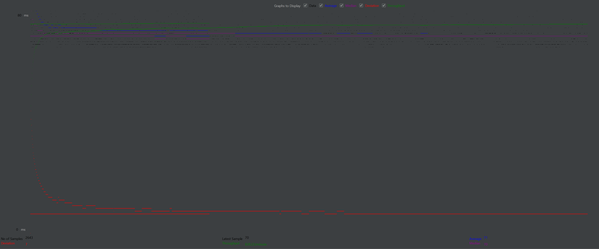
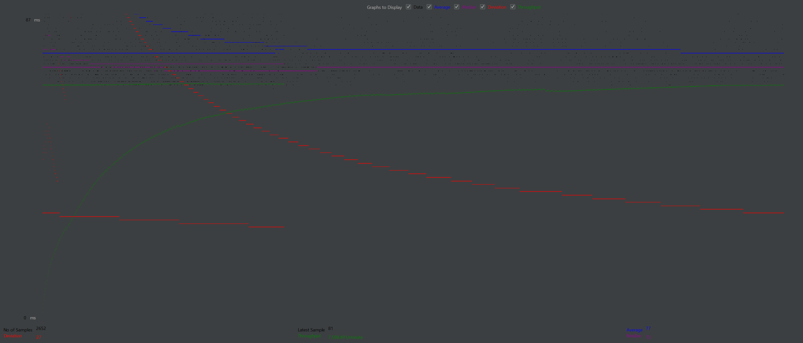
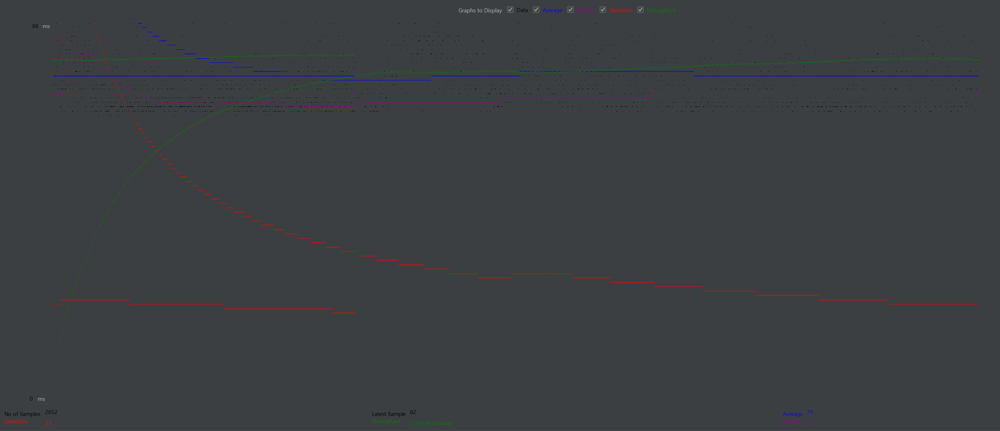
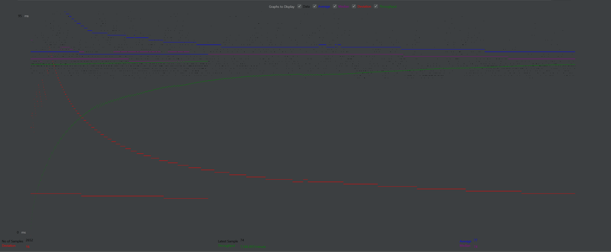
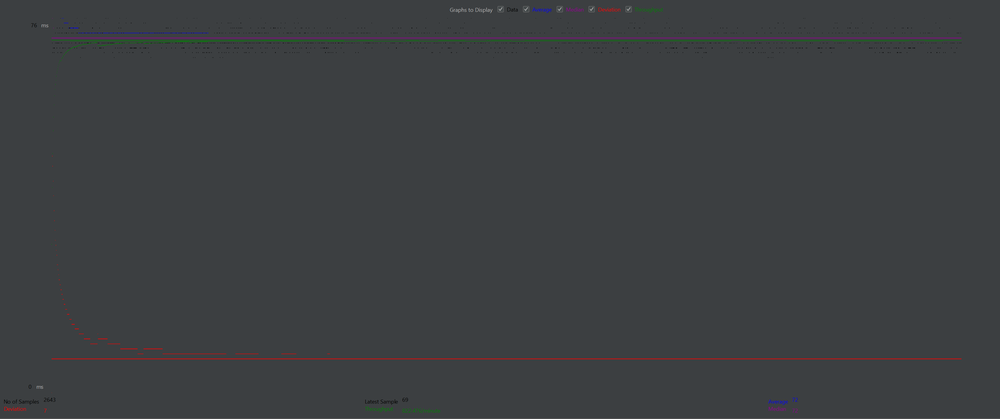
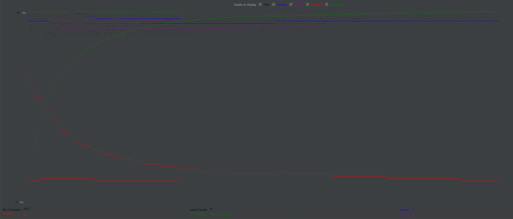
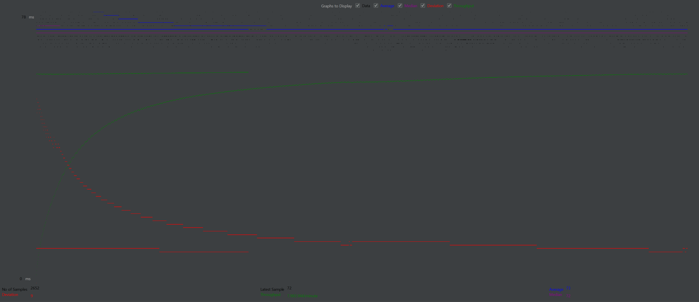

- # General
- # Connection Pooling
    - #### Include the filename/path of all code/configuration files in GitHub of using JDBC Connection Pooling.
- AndroidListServlet
- AndroidLoginServlet
- AutocompleteServlet
- ConfirmationServlet
- DashboardGenreServlet
- DashboardLoginServlet
- DashboardMainServlet
- DashboardMovieServlet
- DashboardStarServlet
- ListServlet
- LoginServlet
- MainServlet
- MovieListServlet
- PlaceOrderServlet
- ShoppingCartServlet
- SingleMovieServlet
- SingleStarServlet
- StarsServlet
- context.xml
    
  - #### Explain how Connection Pooling is utilized in the Fabflix code.
  We've implemented connection pooling through specific configurations in our context XML file. Every servlet that communicates with the mySQL server uses the connection pool now.
    
  - #### Explain how Connection Pooling works with two backend SQL.
  The application will configure two distinct connection pools, one for the master and another for the slave. Each pool manages connections to its respective database.

- # Master/Slave
    - #### Include the filename/path of all code/configuration files in GitHub of routing queries to Master/Slave SQL.
- DashboardGenreServlet
- DashboardLoginServlet
- DashboardMainServlet
- DashboardMovieServlet
- DashboardStarServlet
- PlaceOrderServlet
- context.xml

- #### How read/write requests were routed to Master/Slave SQL?
  When an HTTP request is made, servlets that are involved with write requests will route to the Master's SQL. However, a read only servlet will choose its local host, meaning the instance that the load balancer chose. This allows for the distribution of requests to be even.

- # JMeter TS/TJ Time Logs
    - #### Instructions of how to use the `log_processing.*` script to process the JMeter logs.
  We created a python script that reads the timeLog.txt file created by the ListServlet. The script outputs the lines it read and the total TS and TJ times. Then, we manually compute the averages ourselves. We purposely didn't have the script calculate the average as the load balancing may distribute the more requests to one instance.

- # JMeter TS/TJ Time Measurement Report

| **Single-instance Version Test Plan**          | **Graph Results Screenshot** | **Average Query Time(ms)** | **Average Search Servlet Time(ms)** | **Average JDBC Time(ms)** | **Analysis** |
|------------------------------------------------|------------------------------|----------------------------|-------------------------------------|---------------------------|--------------|
| Case 1: HTTP/1 thread                          |    | 2,519,891.76               | 155,732.4856                        | 2,364,159.274             | ??           |
| Case 2: HTTP/10 threads                        |    | 5,989,003.382              | 89,894.19266                        | 5,899,109.189             | ??           |
| Case 3: HTTPS/10 threads                       |    | 5,620,715.319              | 55,627.77101                        | 5,565,087.548             | ??           |
| Case 4: HTTP/10 threads/No connection pooling  |    | 6,384,852.234              | 1,401,216.43                        | 4,983,635.805             | ??           |

| **Scaled Version Test Plan**                   | **Graph Results Screenshot** | **Average Query Time(ms)** | **Average Search Servlet Time(ms)** | **Average JDBC Time(ms)** | **Analysis** |
|------------------------------------------------|-----------------------------|----------------------------|-------------------------------------|---------------------------|--------------|
| Case 1: HTTP/1 thread                          |  | 2,071,724.712              | 117,868.1215                        | 1,953,856.591             | ??           |
| Case 2: HTTP/10 threads                        |  | 3,572,396.56               | 51,996.54315                        | 3,520,400.017             | ??           |
| Case 3: HTTP/10 threads/No connection pooling  |  | 2,524,138.843              | 438,455.6329                        | 2,085,683.21              | ??           |
